# Car Sales API

Versió: 1.0

Documentació en Markdown de l'API REST exposada per l'aplicació CarSales.Api.

Base URL (local): http://localhost:5000 (o el port que configuri l'entorn). Els endpoints es troben sota `/api/sales`.

## Resum

API per consultar i gestionar anuncis de venda de cotxes. Suporta:

- Llistar anuncis amb filtrat, ordenació i paginació.
- Obtenir detall d'un anunci per id.
- Crear, actualitzar i esborrar anuncis (operacions protegides per API key).

## Swagger UI - Testejar l'API interactivament

L'API exposa una interfície Swagger UI per explorar i provar els endpoints directament des del navegador:

1. Accedeix a Swagger UI:

   - Arrenca l'API (`dotnet run` des de `CarSales.Api`)
   - Obre el navegador a `/swagger` (ex: http://localhost:5000/swagger)

2. Autenticació per a POST/PUT/DELETE:

   - Fes clic al botó "Authorize" (part superior dreta)
   - Al diàleg, introdueix una API key vàlida al camp "X-API-Key"
   - Prem "Authorize" i tanca el diàleg

3. Provar endpoints:

   - Expandeix l'endpoint que vulguis provar (GET/POST/PUT/DELETE)
   - Fes clic a "Try it out"
   - Omple els paràmetres o el cos JSON segons correspongui
   - Prem "Execute" i observa la resposta

4. Casos de prova recomanats:

   - GET /api/sales amb diferents filtres i paginació
   - POST sense autenticar (espera 401)
   - POST amb API key invàlida (espera 403)
   - POST amb API key vàlida i cos JSON correcte (espera 201)
   - PUT/DELETE usant l'id retornat pel POST

5. Notes sobre el cos JSON:

   - Els camps obligatoris apareixen marcats amb asterisc (\*)
   - Pots usar l'exemple que proporciona Swagger com a base
   - Valida els rangs (ex: year entre 1900-2100)

6. Trucs i consells:
   - Després d'un POST exitós (201), copia l'id del recurs creat
   - Usa aquest id per provar GET by id, PUT i DELETE
   - Si la base de dades no està disponible, només podràs provar errors 401/403/400

## Autenticació

Les operacions de modificació (POST, PUT, DELETE) requereixen una API key.

- Header: `X-API-Key: <key>`
- Les claus vàlides es llegeixen de `appsettings.json` (clau `ApiKeys`).

Respostes d'autenticació:

- 401 Unauthorized — quan falta el header `X-API-Key` (contingut: `Missing X-API-Key header.`)
- 403 Forbidden — quan la clau proporcionada no és vàlida (contingut: `Invalid API key.`)

## Conveccions generals

- Dates: no hi ha camps de data específics exposats en els DTOs principals.
- Paginació: paràmetres `Page` (>=1) i `PageSize` (per defecte 25, limitat a entre 1 i 200 a l'API).
- Ordenació: `SortBy` i `SortDir` (`asc` o `desc`). Hi ha una whitelist de columnes per seguretat.

## Models principals

SaleDto

- Id (int)
- Manufacturer (string)
- Model (string)
- EngineSize (decimal)
- FuelType (string)
- Year (int)
- Mileage (int)
- Price (decimal)

CreateSaleRequest (cos de POST)

- Manufacturer (string, required, max 100)
- Model (string, required, max 100)
- EngineSize (decimal, range 0..20)
- FuelType (string, required, max 50)
- Year (int, range 1900..2100)
- Mileage (int?, range 0..2_000_000)
- Price (decimal, range 0..10_000_000)

SalesFilter (paràmetres de query per GET list)

- Manufacturer (string?)
- Model (string?)
- FuelType (string?)
- Year (int?)
- EngineSizeMin/EngineSizeMax (decimal?)
- MileageMin/MileageMax (int?)
- PriceMin/PriceMax (decimal?)
- Page (int, default 1)
- PageSize (int, default 25, clamp 1..200)
- SortBy (string, default `id`) — valors permitits: `id`, `manufacturer`, `model`, `enginesize`, `fueltype`, `year`, `mileage`, `price`.
- SortDir (string, `asc` o `desc`, default `asc`).

PagedResult<T>

- Items: array amb els elements (SaleDto en el cas de llistat)
- Page
- PageSize
- TotalCount
- TotalPages (calculat)

## Endpoints

Base path: `/api/sales`

### GET /api/sales

Llista anuncis amb filtrat, ordenació i paginació.

Query parameters (opcions resumides):

- `manufacturer` (string)
- `model` (string)
- `fuelType` (string)
- `year` (int)
- `engineSizeMin` / `engineSizeMax` (decimal)
- `mileageMin` / `mileageMax` (int)
- `priceMin` / `priceMax` (decimal)
- `page` (int, default 1)
- `pageSize` (int, default 25, clamped 1..200)
- `sortBy` (see allowed list arriba)
- `sortDir` (`asc` or `desc`)

Response: 200 OK

Body (JSON): PagedResult<SaleDto>

Exemple curl:

```bash
curl "http://localhost:5000/api/sales?manufacturer=Toyota&page=1&pageSize=10&sortBy=price&sortDir=desc"
```

Exemple de resposta (fragment):

```json
{
  "items": [
    {
      "id": 123,
      "manufacturer": "Toyota",
      "model": "Corolla",
      "engineSize": 1.6,
      "fuelType": "Petrol",
      "year": 2018,
      "mileage": 45000,
      "price": 15000.0
    }
  ],
  "page": 1,
  "pageSize": 10,
  "totalCount": 42,
  "totalPages": 5
}
```

### GET /api/sales/{id}

Obté un anunci per `id`.

Response:

- 200 OK — SaleDto
- 404 Not Found — `{ message: "Sale with id {id} not found." }`

Exemple curl:

```bash
curl "http://localhost:5000/api/sales/123"
```

### POST /api/sales

Crea un nou anunci. Requereix header `X-API-Key`.

Request:

- Header: `X-API-Key: <key>`
- Body: `CreateSaleRequest` en JSON.

Response:

- 201 Created — Location header apuntant a `/api/sales/{newId}` i body amb el `SaleDto` creat.
- 400 Bad Request — errors de validació (ModelState)
- 401 / 403 — errors d'autenticació/autorització (veure secció Autenticació)

Exemple curl:

```bash
curl -X POST "http://localhost:5000/api/sales" \
  -H "Content-Type: application/json" \
  -H "X-API-Key: your_api_key_here" \
  -d '{"manufacturer":"Toyota","model":"Corolla","engineSize":1.6,"fuelType":"Petrol","year":2018,"mileage":45000,"price":15000.00}'
```

### PUT /api/sales/{id}

Actualitza un anunci existent. Requereix `X-API-Key`.

Request: `UpdateSaleRequest` (assumit igual que `CreateSaleRequest`).

Response:

- 204 No Content — actualització correcta
- 400 Bad Request — model no vàlid
- 404 Not Found — si l'id no existeix (`{ message: "Sale with id {id} not found." }`)
- 401 / 403 — autenticació/autorització

Exemple curl:

```bash
curl -X PUT "http://localhost:5000/api/sales/123" \
  -H "Content-Type: application/json" \
  -H "X-API-Key: your_api_key_here" \
  -d '{"manufacturer":"Toyota","model":"Corolla","engineSize":1.6,"fuelType":"Petrol","year":2018,"mileage":46000,"price":14500.00}'
```

### DELETE /api/sales/{id}

Esborra un anunci. Requereix `X-API-Key`.

Response:

- 204 No Content — esborrat
- 404 Not Found — si l'id no existeix
- 401 / 403 — autenticació/autorització

Exemple curl:

```bash
curl -X DELETE "http://localhost:5000/api/sales/123" \
  -H "X-API-Key: your_api_key_here"
```

## Errors i codis

- 200 OK — lectura correcta
- 201 Created — recurs creat
- 204 No Content — operació d'escriptura correcta sense cos de resposta
- 400 Bad Request — errors de validació (ModelState)
- 401 Unauthorized — falta el header `X-API-Key`
- 403 Forbidden — API key no vàlida
- 404 Not Found — recurs no existeix

## Com executar l'API localment

1. Assegura't de tenir .NET SDK (project sembla apuntar a .NET 8/9).
2. Afegeix/actualitza `appsettings.json` amb la cadena de connexió i les claus:

```json
{
  "ConnectionStrings": {
    "CarSalesDb": "server=localhost;port=3306;user=root;password=YourPassword;database=car_sales;"
  },
  "ApiKeys": ["your_api_key_here"]
}
```

3. Des del directori `CarSales.Api` executar:

```powershell
dotnet build
dotnet run
```

4. Prova els endpoints amb:
   - Swagger UI (/swagger)
   - curl (exemples en aquesta doc)
   - El fitxer `CarSales.Api.http` (si s'afegeix)
   - Postman o eines similars

## Provar l'API des de Swagger UI i per línia de comandes

Aquestes instruccions recullen tot el necessari per provar els endpoints (GET, POST, PUT, DELETE) tant des de Swagger UI com amb curl/PowerShell o amb la extensió REST Client de VS Code.

IMPORTANT: Les operacions de modificació (POST, PUT, DELETE) requereixen l'header `X-API-Key` amb una clau vàlida. Revisa `CarSales.Api/appsettings.json` per veure les claus definides a l'entorn local (ex: `albert-dev-1234`). No exposis claus reals en repositoris públics.

### 1) Swagger UI (interactiu)

- Obrir l'UI: arrenca l'app (`dotnet run` des de `CarSales.Api`) i obre `http://localhost:<port>/swagger` (el port per defecte de l'entorn pot variar, per exemple `5058`).
- Autoritzar per operacions protegides:
  1. Fes clic a `Authorize` (part superior dreta).
  2. Al camp `Value` introdueix EXACTAMENT la clau (sense cometes): per exemple `albert-dev-1234`.
  3. Prem `Authorize` i tanca el diàleg.
- Després, obre l'endpoint (ex. `PUT /api/Sales/{id}`), prem `Try it out`, omple els camps i pressiona `Execute`.

### 2) Proves amb curl (PowerShell)

Substitueix el port `5058` si el teu servidor utilitza un altre.

- GET: llistar tots

```powershell
curl.exe "http://localhost:5058/api/Sales"
```

- GET amb filtres

```powershell
curl.exe "http://localhost:5058/api/Sales?manufacturer=Toyota&year=2018&page=1&pageSize=10&sortBy=price&sortDir=desc"
```

- POST (crear) — requereix X-API-Key

```powershell
curl.exe -v -X POST "http://localhost:5058/api/Sales" \
  -H "Content-Type: application/json" \
  -H "X-API-Key: albert-dev-1234" \
  -d '{"manufacturer":"Toyota","model":"Corolla","engineSize":1.6,"fuelType":"Petrol","year":2018,"mileage":45000,"price":15000.00}'
```

- PUT (actualitzar) — requereix X-API-Key

```powershell
curl.exe -v -X PUT "http://localhost:5058/api/Sales/69" \
  -H "Content-Type: application/json" \
  -H "X-API-Key: albert-dev-1234" \
  -d '{"manufacturer":"Honda","model":"Accord","engineSize":2.0,"fuelType":"Petrol","year":2025,"mileage":20000,"price":10000}'
```

- DELETE (esborrar) — requereix X-API-Key

```powershell
curl.exe -v -X DELETE "http://localhost:5058/api/Sales/69" \
  -H "X-API-Key: albert-dev-1234"
```

### 3) VS Code REST Client snippet

Pots crear un fitxer `CarSales.Api.http` a l'arrel de `CarSales.Api` amb aquest contingut per executar les proves des de VS Code (click en "Send Request"):

```
### List all
GET http://localhost:5058/api/Sales

### Filter by manufacturer
GET http://localhost:5058/api/Sales?manufacturer=Toyota

### Range and pagination
GET http://localhost:5058/api/Sales?engineSizeMin=1.0&engineSizeMax=3.0&priceMax=15000&page=1&pageSize=5

### Create sale (POST)
POST http://localhost:5058/api/Sales
Content-Type: application/json
X-API-Key: albert-dev-1234

{
  "manufacturer":"Toyota",
  "model":"Corolla",
  "engineSize":1.6,
  "fuelType":"Petrol",
  "year":2018,
  "mileage":45000,
  "price":15000.00
}

### Update sale (PUT)
PUT http://localhost:5058/api/Sales/69
Content-Type: application/json
X-API-Key: albert-dev-1234

{
  "manufacturer":"Honda",
  "model":"Accord",
  "engineSize":2.0,
  "fuelType":"Petrol",
  "year":2025,
  "mileage":20000,
  "price":10000
}

### Delete sale
DELETE http://localhost:5058/api/Sales/69
X-API-Key: albert-dev-1234
```

## Captures de pantalla

### Pàgina principal

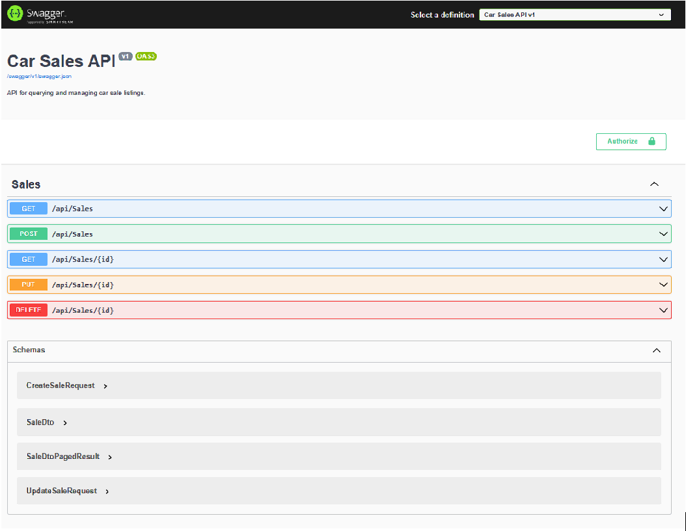

## GET /API/Sales

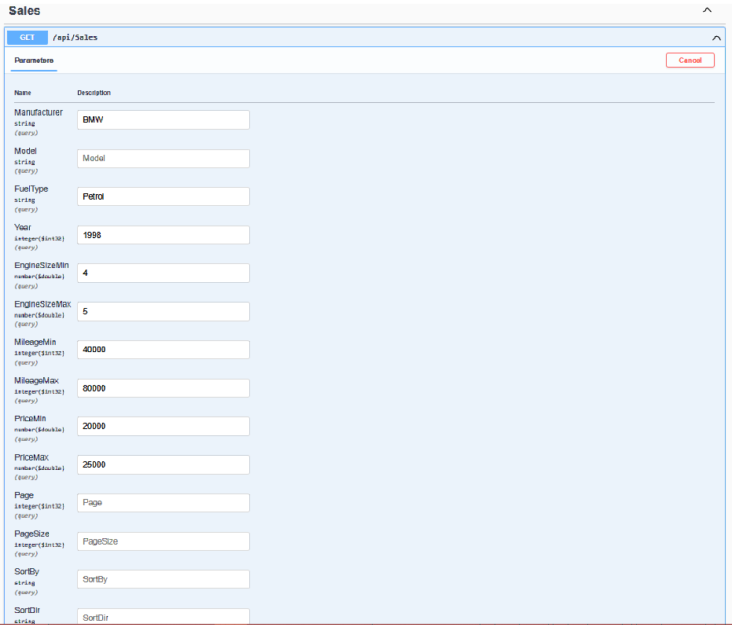

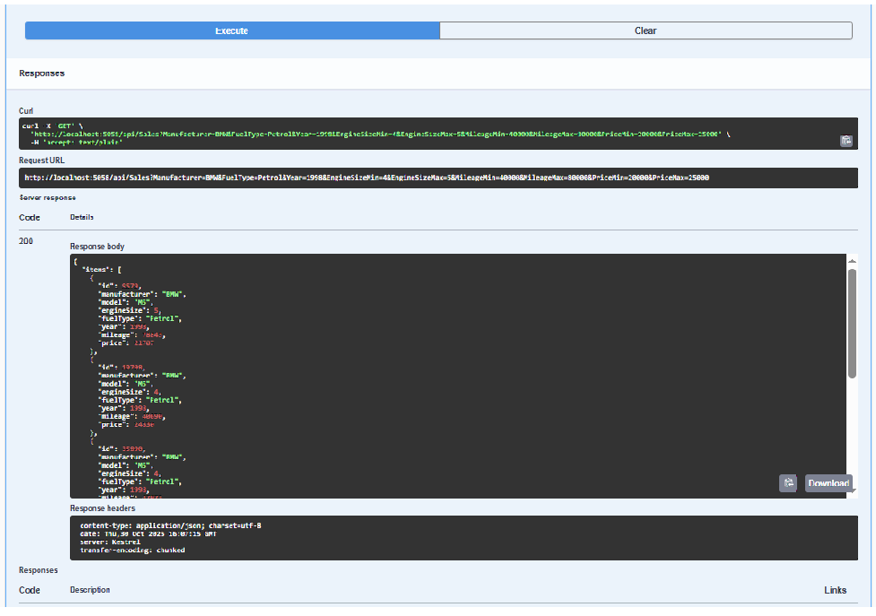

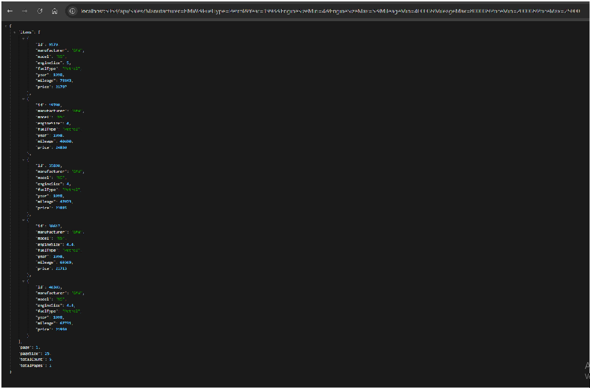

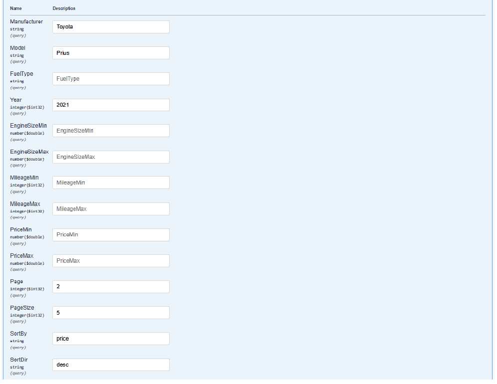

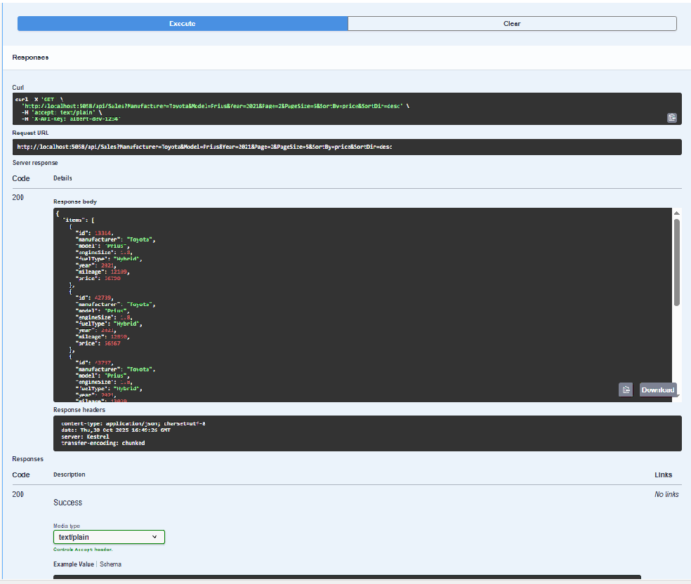

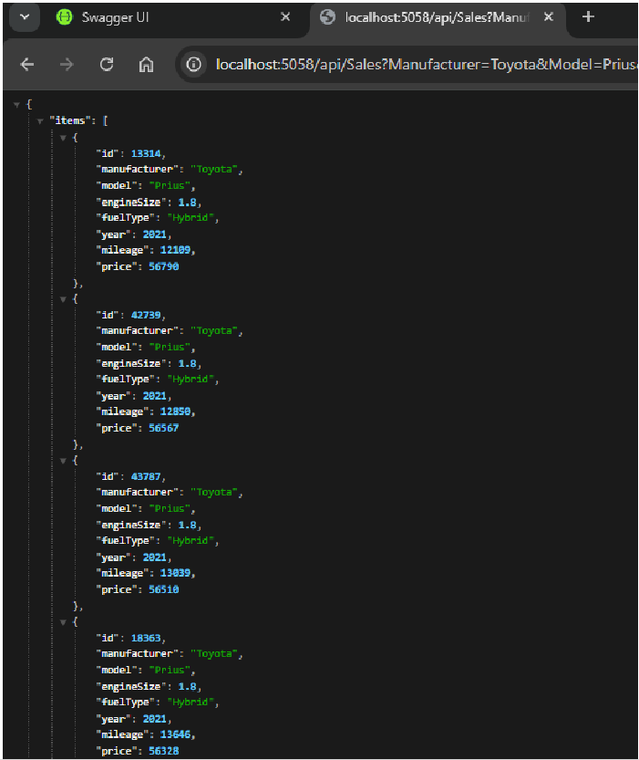

## POST /API/Sales

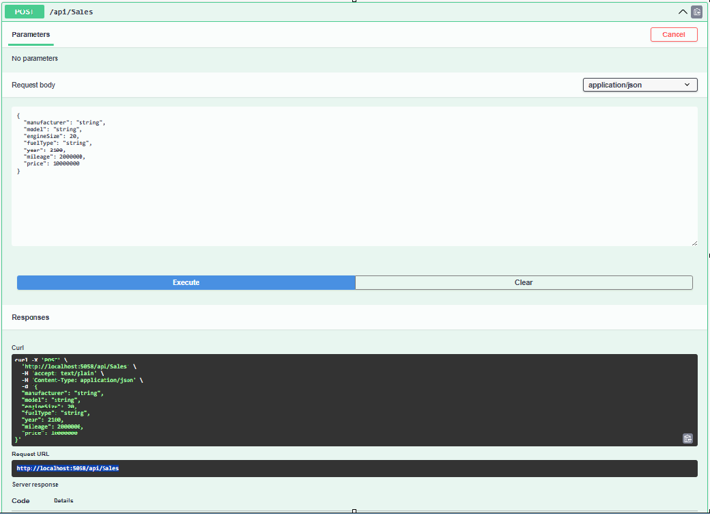

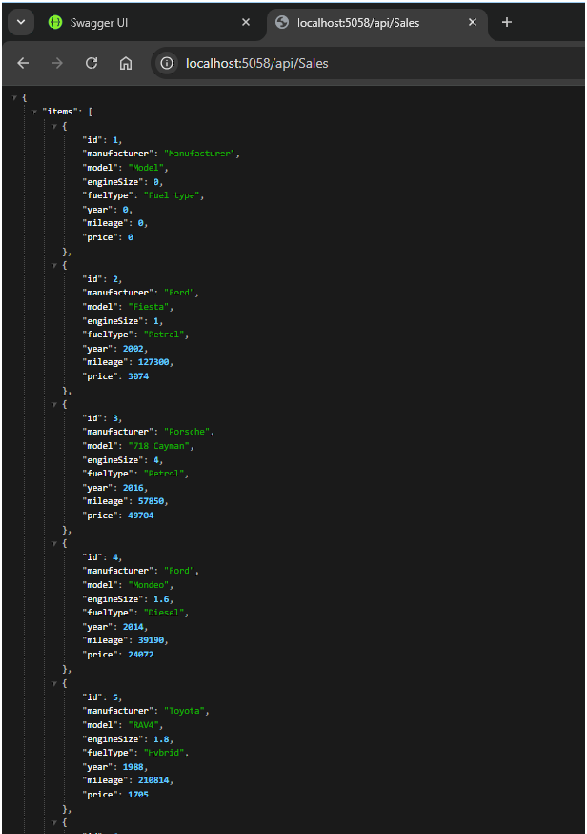

## GET /API/Sales/{id}

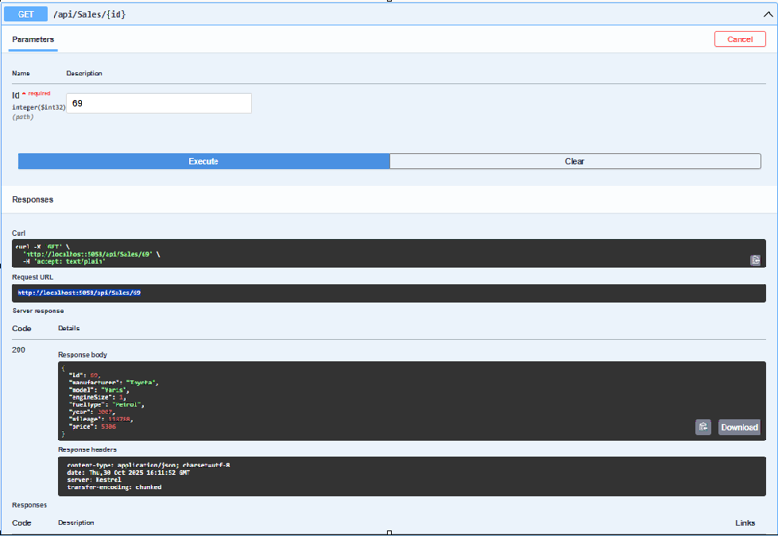

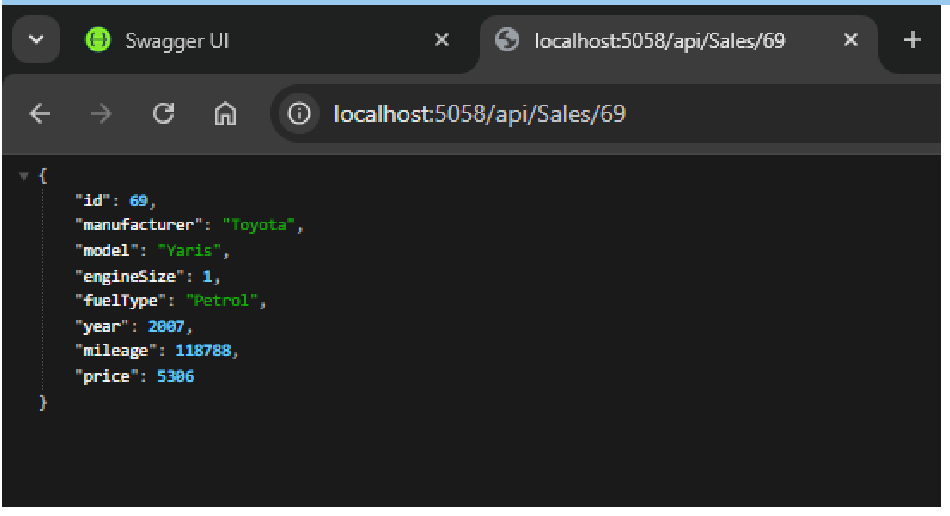

## PUT /API/Sales/{id}

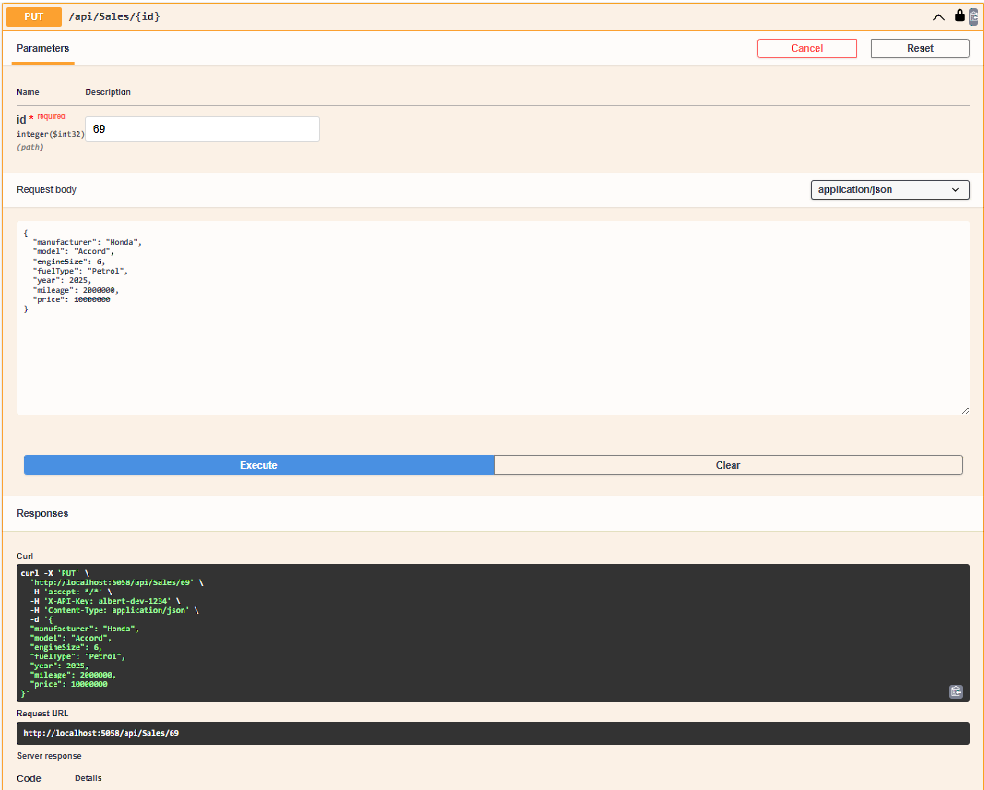

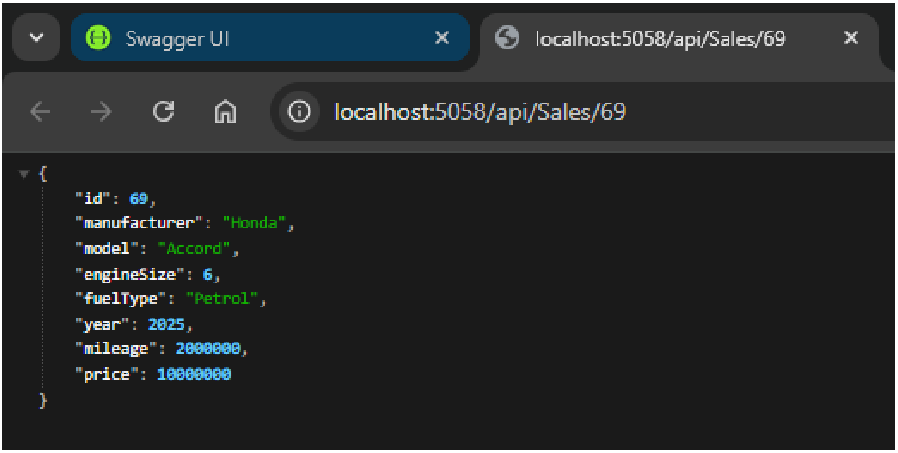

## DELETE /API/Sales/{id}

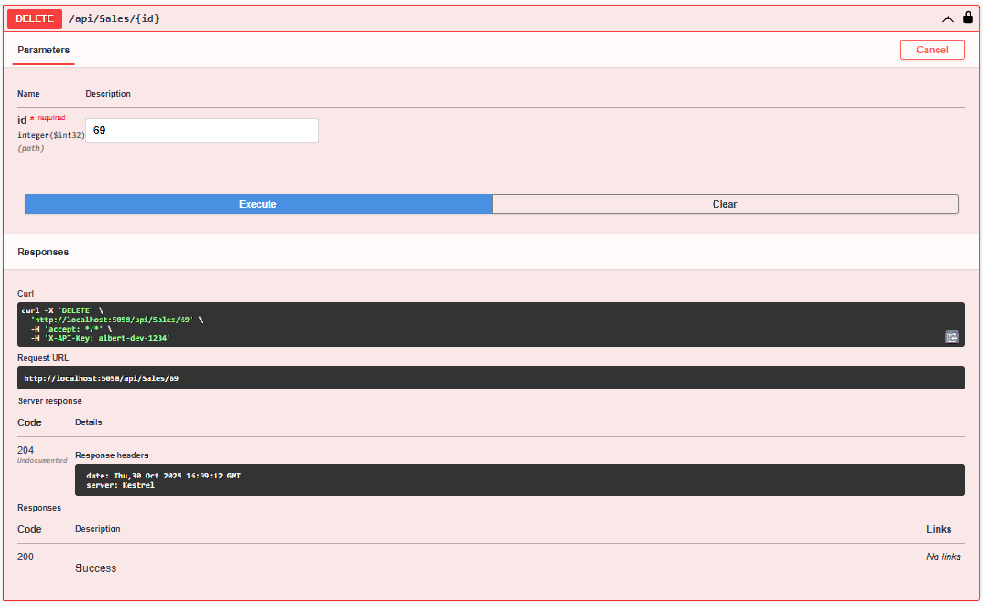

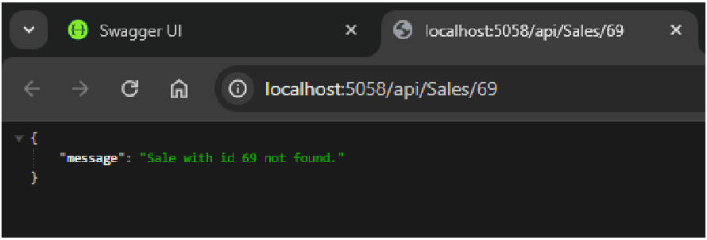
